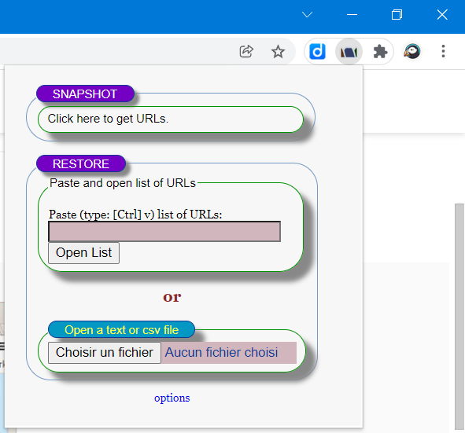
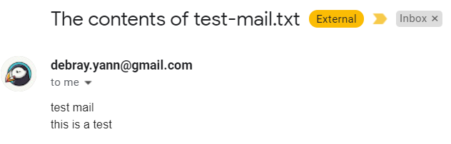
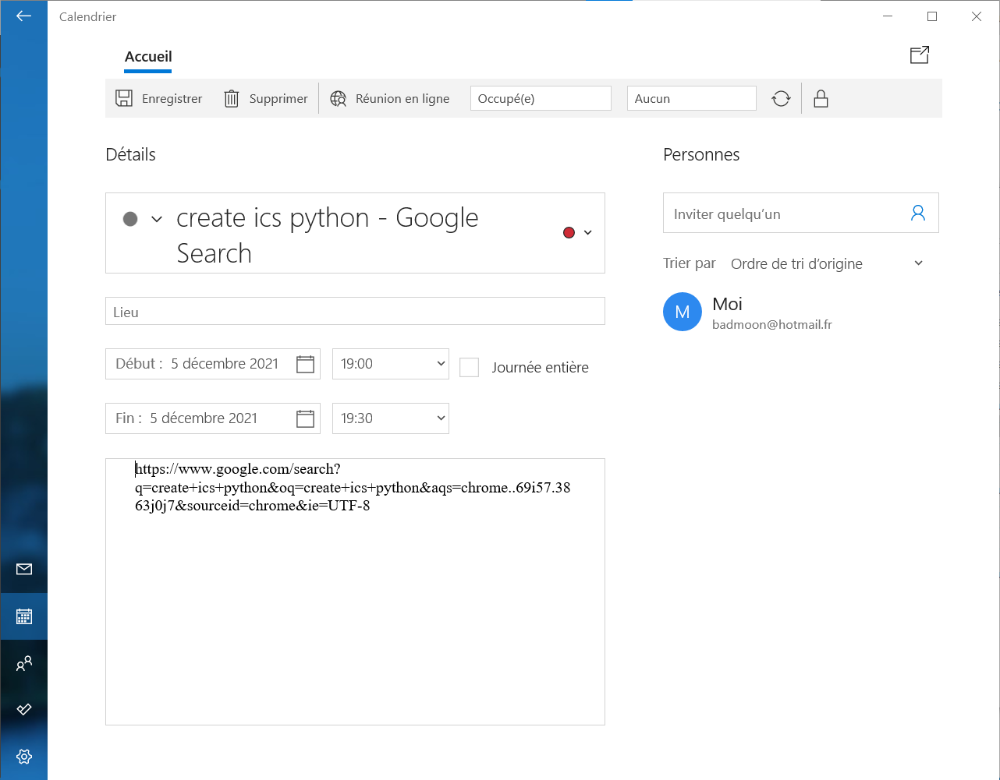

# Tab Manager

1. Retrieve list of active tabs
2. Create and mail an invite grouping tabs

## 1. Tab list

Use the Tab-Snap chrome extension:

https://chrome.google.com/webstore/detail/tab-snap/ajjloplcjllkammemhenacfjcccockde

## 2. Mail tabs as invitation

### 2.1. Email

https://docs.python.org/3/library/email.examples.html

https://stackabuse.com/how-to-send-emails-with-gmail-using-python/

success!!!

### 2.2. Meeting invitation

https://askcodez.com/lenvoi-des-invitations-a-des-reunions-avec-python.html

https://icalendar.readthedocs.io/en/latest/

https://icspy.readthedocs.io/en/stable/

